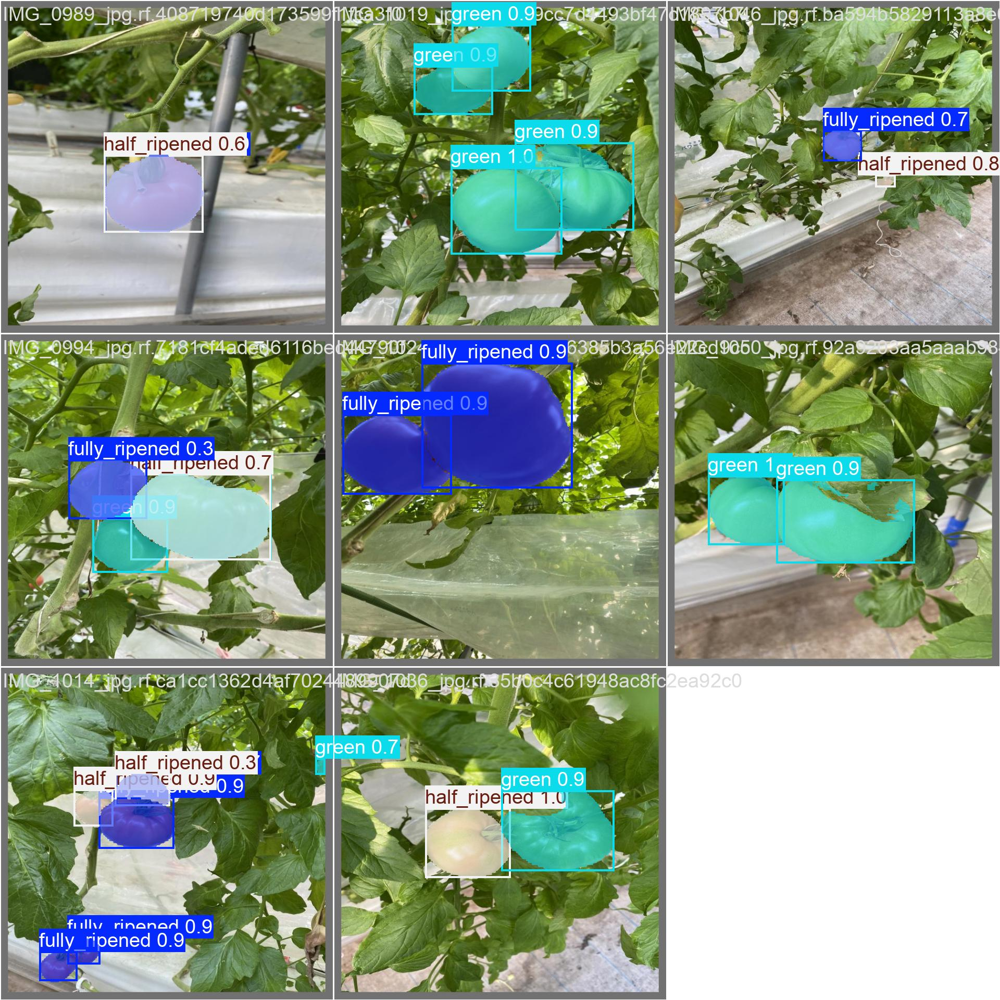
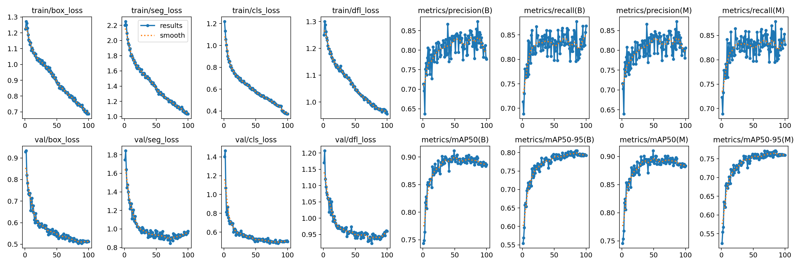
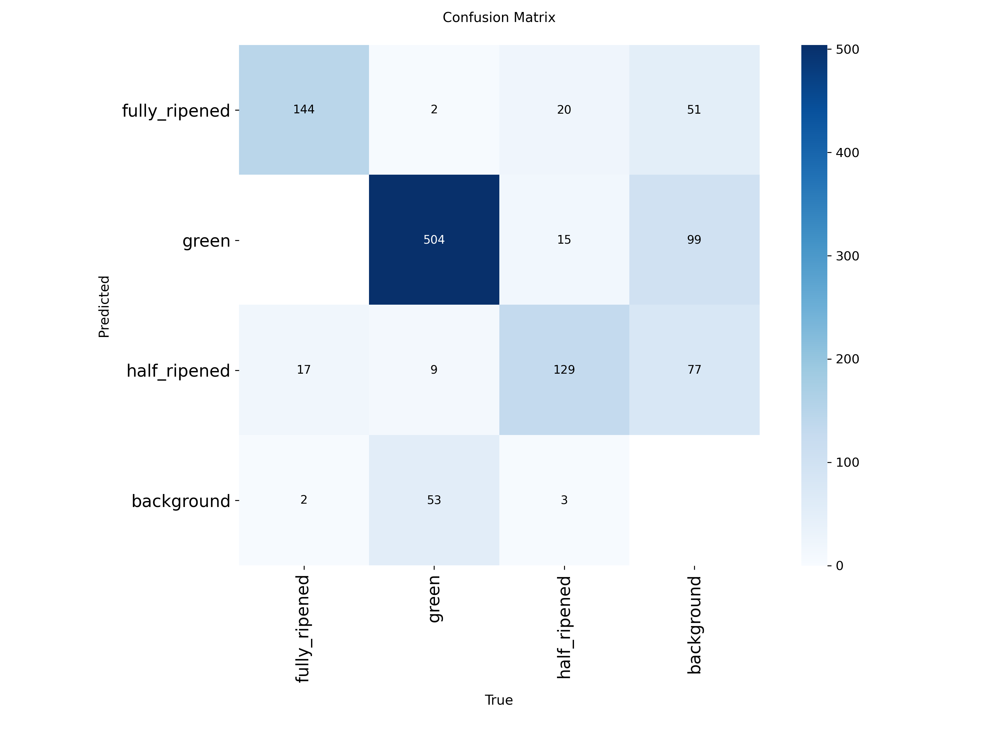

# 🍅 YOLO11 Tomato Detection/Segmentation

[](https://opensource.org/licenses/MIT)
[](https://www.python.org/downloads/)
[](https://pytorch.org/)
[](https://ultralytics.com/)

**High-performance instance segmentation for automated tomato ripeness classification using YOLO11**



## Project Overview

This project implements state-of-the-art instance segmentation for classifying tomato ripeness stages using YOLO11. The model achieves **90.1% mAP@0.5** and **89.8% mask mAP@0.5** on the Laboro Tomato dataset, making it suitable for real-world agricultural applications.

### 🍅 Ripeness Classes
- **🟢 Green**: Unripe tomatoes
- **🟡 Half-ripened**: Partially ripe tomatoes  
- **🔴 Fully-ripened**: Ready-to-harvest tomatoes

## Performance Metrics

| Metric | Box Detection | Instance Segmentation |
|--------|---------------|----------------------|
| **mAP@0.5** | 90.1% | 89.8% |
| **mAP@0.5:0.95** | 80.5% | 77.1% |
| **Inference Speed** | 28ms | 28ms |

### Per-Class Performance
| Class | Precision | Recall | mAP@0.5 |
|-------|-----------|---------|---------|
| Fully Ripened | 91.4% | 91.4% | 91.3% |
| Green | 86.8% | 91.8% | 91.8% |
| Half Ripened | 85.0% | 87.1% | 87.1% |

## Quick Start

### Prerequisites
- Python 3.10+
- NVIDIA GPU with CUDA support (recommended)
- 8GB+ RAM

### Installation

1. **Clone the repository**
```bash
git clone https://github.com/yourusername/yolo11-tomato-segmentation.git
cd yolo11-tomato-segmentation
```

2. **Set up environment**
```bash
chmod +x scripts/setup_environment.sh
./scripts/setup_environment.sh
source venv/bin/activate
```

3. **Download pre-trained model**
```bash
# Download our trained model
wget -O models/best.pt "https://github.com/yourusername/yolo11-tomato-segmentation/releases/download/v1.0/best.pt"
```

### Inference

**Single Image Prediction**
```bash
python src/predict.py --model models/best.pt --source data/sample_images/tomato1.jpg
```

**Batch Processing**
```bash
python src/predict.py --model models/best.pt --source data/sample_images/ --save-dir results/batch_predictions
```

**Python API**
```python
from ultralytics import YOLO

# Load model
model = YOLO('models/best.pt')

# Run inference
results = model('path/to/your/tomato_image.jpg')

# Display results
results[0].show()
```

## Training

### Dataset Setup
1. **Download Laboro Tomato Dataset**
```bash
python scripts/download_data.py
```

2. **Train from scratch**
```bash
python src/train.py --data data/data_config.yaml --model x --epochs 100 --batch 4
```

3. **Resume training**
```bash
python src/train.py --resume tomato_segmentation/training_run/weights/last.pt
```

### Training Configuration
- **Model**: YOLO11x-seg (62M parameters)
- **Input Size**: 640×640
- **Batch Size**: 4
- **Epochs**: 100
- **Optimizer**: AdamW
- **GPU Memory**: ~6GB (RTX 4060)

## Dataset Information

**Laboro Tomato Dataset** from [Roboflow Universe](https://universe.roboflow.com/jalals-lab/laboro-tomato-kwpth/dataset/2)

- **Training Images**: 2,001
- **Validation Images**: 86  
- **Total Instances**: 898
- **Annotation Format**: YOLO segmentation masks
- **License**: CC BY 4.0

## Model Architecture

- **Backbone**: YOLO11x-seg
- **Input Resolution**: 640×640
- **Parameters**: 62,053,721
- **GFLOPs**: 319.7
- **Output**: Bounding boxes + segmentation masks

## Results Analysis


### Training Curves


### Confusion Matrix


### Sample Predictions


## Applications

- Robotic Harvesting**: Automated fruit picking systems
- Yield Estimation**: Greenhouse monitoring and analytics
- Sorting Systems**: Post-harvest quality control
- Mobile Apps**: Farm management tools
- Research**: Agricultural computer vision studies

## Hardware Requirements

### Minimum
- GPU: GTX 1060 6GB / RTX 3050
- RAM: 8GB+
- Storage: 5GB free space

### Recommended
- GPU: RTX 4060+ / RTX 3070+
- RAM: 16GB+
- Storage: 10GB+ SSD

## Documentation

- [Dataset Details](docs/DATASET.md)
- [Training Guide](docs/TRAINING.md)
- [Deployment Options](docs/DEPLOYMENT.md)
- [API Reference](docs/API.md)

## Contributing

Contributions are welcome! Please feel free to submit a Pull Request.

1. Fork the repository
2. Create your feature branch (`git checkout -b feature/AmazingFeature`)
3. Commit your changes (`git commit -m 'Add some AmazingFeature'`)
4. Push to the branch (`git push origin feature/AmazingFeature`)
5. Open a Pull Request

## 📄 License

This project is licensed under the MIT License - see the [LICENSE](LICENSE) file for details.

## 🙏 Acknowledgments

- [Ultralytics](https://ultralytics.com/) for the YOLO11 framework
- [Roboflow](https://roboflow.com/) for the Laboro Tomato dataset
- [Jalal's Lab](https://universe.roboflow.com/jalals-lab) for dataset curation

## 📞 Contact

- **Author**: Dieudonne Fonyuy Y.
- **Email**: Dieudonne.yufonyuy@gmail.com
- **LinkedIn**: 
- **Project Link**: 


⭐ **Star this repository if you found it helpful!**
